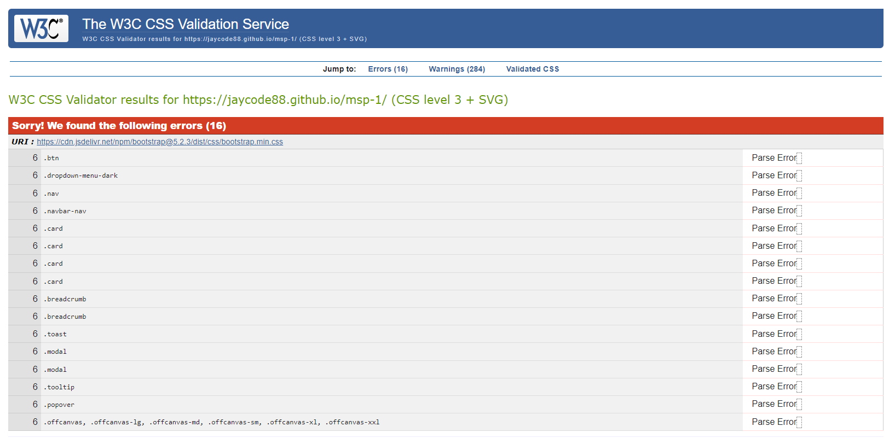

# Testing

Return back to the [README.md](README.md)

In this section, you need to convince the assessors that you have conducted enough testing to legitimately believe that the site works well. 

Essentially, in this part, you should go over all of your project's features, and ensure that they all work as intended, 

with the project providing an easy and straightforward way for the users to achieve their goals. 

## Code Validation

### HTML

I have used the recommended [HTML W3C Validator](https://validator.w3.org) to validate Each of my HTML files.

[Index Test Result](https://validator.w3.org/nu/?doc=https%3A%2F%2Fjaycode88.github.io%2Fmsp-1%2F)

[Gallery Test Result](https://validator.w3.org/nu/?doc=https%3A%2F%2Fjaycode88.github.io%2Fmsp-1%2Fgallery.html)

[FAQ Test Result](https://validator.w3.org/nu/?doc=https%3A%2F%2Fjaycode88.github.io%2Fmsp-1%2Ffaq.html)

### CSS

I have used the recommended [CSS Jigsaw Validator](https://jigsaw.w3.org/css-validator) to validate all of my CSS files.

There are errors shown, But these are all due to third party applications. All CSS code entered by myself is validated.

[CSS Test Results](https://jigsaw.w3.org/css-validator/validator?uri=https%3A%2F%2Fjaycode88.github.io%2Fmsp-1%2F&profile=css3svg&usermedium=all&warning=1&vextwarning=&lang=en#errors)

## Browser Capability
